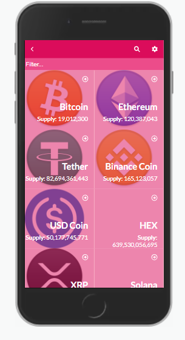

# Crypto Tickers

## Screenshot 

> The app retrieves available tickers from the API lists them in an home page. When a particular ticker is clicker it routes to the information of that ticker.

## Built With

- React

## Getting Started

### Setup

1. git clone https://github.com/mnekx/crypto-tickers.git
2. cd crypto-tickers
3. npm install
4. npm start to serve into local 3000 port

### Install

1. git clone https://github.com/mnekx/crypto-tickers.git
2. cd crypto-tickers
3. npm install
4. npm start to serve into local 3000 port

### Run tests

npm run test

### Deployment

https://crypto-tickers.herokuapp.com/

## Authors

👤 **Mnemba Chambuya**

- GitHub: [@mnekx](https://github.com/mnekx)
- Twitter: [@MnembaChambuya](https://twitter.com/MnembaChambuya)
- LinkedIn: [mnemba-chambuya](https://linkedin.com/in/mnemba-chambuya)

## 🤝 Contributing

Contributions, issues, and feature requests are welcome!

Feel free to check the [issues page](../../issues/).

## Show your support

Give a ⭐️ if you like this project!

## 📝 License

This project is [MIT](./MIT.md) licensed.

## Aknowledgements

Thanks to Nelson Sakwa, author of the original [design](https://www.behance.net/gallery/31579789/Ballhead-App-(Free-PSDs)).
